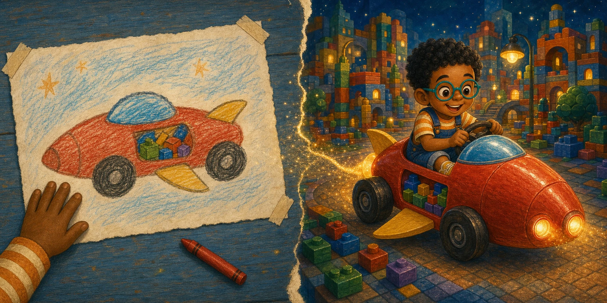
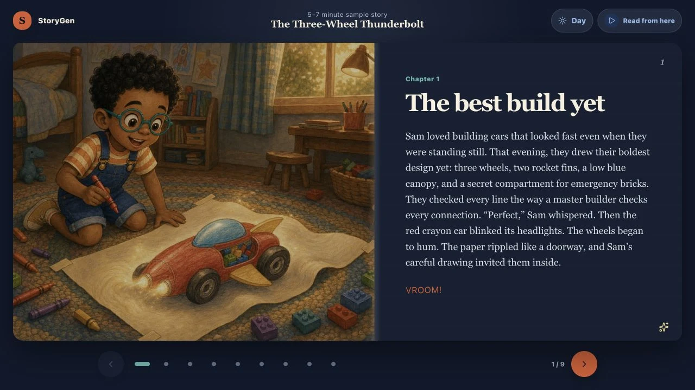

# StoryGen

<p align="center">
  
</p>

<p align="center">
  
</p>

StoryGen is a parent-supervised bedtime-story app that turns a child's drawing
or photographed build into a fresh, illustrated nine-page adventure starring
your child. This repository is the public, secret-free source for a personal
family project, shared for inspection and careful experimentation rather than
as a hosted child account service.

> **Want to make one for your child? [Start here.](docs/GETTING-STARTED.md)**

## What it does

- brings a drawing or photographed build to life as a story character, vehicle,
  object, or backdrop;
- plans a nine-page adventure for age 6 or ages 7–9, with an optional
  child-safe villain and up to two extra themes;
- paints nine new landscape illustrations, using page 1 to keep later scenes
  visually consistent;
- combines night mode, read-aloud, swipe navigation, wake lock, background
  painting, and resume into one bedtime reader; and
- keeps the current story and an eight-book shelf on the current browser/device
  instead of a cloud story account.

## Before you start: you need an OpenAI API key

> StoryGen writes stories and paints illustrations using OpenAI's models, so
> anyone running it needs their own OpenAI API account and private key. Create
> the account and key at [platform.openai.com](https://platform.openai.com/api-keys),
> place the key only in the local `.dev.vars` file, and never put it in files
> recorded by GitHub. Before making the first story, set a monthly spending
> limit on the OpenAI account using the
> [spending-limit guide](https://developers.openai.com/api/docs/guides/spend-limits).

## Quick start

You need:

- **Git**, the free tool used to copy this project from GitHub;
- **Node.js 22.13 or newer**, including its `npm` software installer; and
- **an OpenAI API account and key** that can use the project's configured
  story and image models.

On macOS or Linux, open Terminal inside the downloaded StoryGen folder and run:

```bash
npm ci
cp -n .dev.vars.example .dev.vars
# Add your OpenAI key after OPENAI_API_KEY= in .dev.vars.
npm run setup:local
npm run dev
```

Local story generation needs the small counters database—see the
[setup guide](docs/GETTING-STARTED.md) for the assisted path, Windows commands,
plain-language checkpoints, and troubleshooting.

**Deploying your own copy? See [docs/DEPLOYMENT.md](docs/DEPLOYMENT.md).**

## How it works

The browser makes the upload smaller, asks StoryGen's server-side part to have
OpenAI plan and illustrate the story, and saves the finished book on the
device:

```text
Browser
  ├─ resize/compress the selected picture
  ├─ POST /api/generate-story
  │    └─ OpenAI keeps planning while the browser checks for completion
  ├─ POST /api/generate-story-status until complete
  ├─ POST /api/generate-page-image
  │    ├─ page 1 establishes the digitally verified visual reference
  │    └─ pages 2–9 paint up to four pictures at the same time
  └─ save current story and shelf in IndexedDB

GET /api/story-allowance
  └─ D1 short-lived anonymous counters
```

`POST` and `GET` are ordinary kinds of web request. See
[docs/ARCHITECTURE.md](docs/ARCHITECTURE.md) for the full generation flow,
save-and-resume design, technology stack, and trust boundaries.

## Privacy and safety

The browser makes the upload smaller, then sends it and the story choices to
the server-side part of your StoryGen copy. In an online copy, that server-side
part runs on Cloudflare. As needed, it forwards the reduced upload, story
choices, story text, bundled character picture, optional villain picture, and
page-1 visual reference to OpenAI, which writes and illustrates the story. It
does this through an API (a structured way for one program to ask another
program for work). Saved stories and generated art live in IndexedDB (private
storage built into that browser on that device). Cloudflare D1, a small
database Cloudflare provides, stores only short-lived request counters. Those
counters use HMAC-derived identifiers (a one-way, secret-key code rather than a
name or email address). The database does not contain uploads, story prose, or
generated illustrations.

Read [PRIVACY.md](PRIVACY.md) and [SECURITY.md](SECURITY.md) before running or
deploying the project. Avoid pictures with unnecessary identifying details,
and keep an adult in the loop because generated output can be imperfect.

## Known limitations

- Saved stories and generated art remain in one browser's IndexedDB. There is
  no cloud backup or cross-device synchronization.
- Same-origin checks (rejecting requests that appear to come from a different
  website) and anonymous counters reduce casual abuse but do not prove who a
  person is or require them to sign in.
- Request-count controls are not a currency-based spending cap. A request
  can still cost money if it fails or is abandoned. Temporary OpenAI service
  failures can trigger a small, limited number of retries. Do not publish a
  deployment backed by a personal paid key without access restrictions,
  billing alerts, and limits suitable for its audience.
- Which AI models are available, how they behave, how long they take, and what
  they cost can change after this version of the source is published.
- Generative text and images can be slow, inconsistent, or unsuitable. An
  adult must supervise use and may need to retry or discard output.
- This source release omits the private keys and identifiers used by the
  family's live copy, its live hosting project ID, and its web address.

## License

Source code is available under the [MIT License](LICENSE), a standard license
that permits reuse of the code under its terms. That license does **not** cover
the reserved character art, sample story illustrations, or social artwork
listed in [ASSETS.md](ASSETS.md). Those fictional demonstration media are not
licensed for reuse, for teaching another AI model, or for separate
redistribution.
